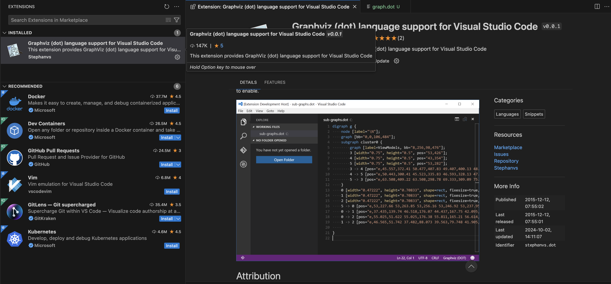

# Terraform Blocks
> Terraform으로 인프라를 구성하기 위한 다음과 같은 선언 블록들이 있다.

- terraform 블록
- resource 블록
- data 블록
- variable 블록
- local 블록
- output 블록

# Terraform Block
> 테라폼의 구성을 명시하는데 사용

- terraform version
- provider version

```hcl
terraform {
  required_version = "~> 1.3.0" # 테라폼 버전

  required_providers { # 프로바이더 버전을 나열
    random = {
      version = ">= 3.0.0, < 3.1.0"
    }
    aws = {
      version = "4.2.0"
    }
  }

  cloud { # Cloud/Enterprise 같은 원격 실행을 위한 정보
    organization = "<MY_ORG_NAME>"
    workspaces {
      name = "my-first-workspace"
    }
  }

  backend "local" { # state를 보관하는 위치를 지정
    path = "relative/path/to/terraform.tfstate"
  }
}
```

## Terraform Version
- `required_version`: 테라폼 버전을 지정

```hcl
terraform {
  required_version = "~> 1.3.0" # 테라폼 버전
}
```

## Provider Version
- `required_providers`: 프로바이더 버전을 나열
- Terraform Registry 에서 원하는 프로바이더를 검색할 수 있다.
  - https://registry.terraform.io/
  - https://search.opentofu.org/

```hcl
terraform {
  required_providers {
    local = {
      source = "opentofu/local"
      version = "2.5.1"
    }
  }
}
```

# Cloud Block
- Cloud/Enterprise 같은 원격 실행을 위한 정보
- State 저장소를 의미하는 `backend`의 remote

```hcl
terraform {
  cloud {
    hostname = "app.terraform.io"
    organization = "<MY_ORG_NAME>"
    workspaces {
      name = "my-first-workspace"
    }
  }
}
```

# Backend Block
- Terraform 실행 시 저장되는 state의 저장 위치를 선언
- Terraform이 실행되는 동안 `.terraform.tfstate.lock.info` 파일이 생성되면서
  - 해당 state를 동시에 사용하지 못하도록 잠금 처리한다.
  - `-lock=false` 옵션을 사용하여 잠금을 무시할 수 있다.

```hcl
terraform {
  backend "local" {
    path = "state/terraform.tfstate"
  }
}
```

## `terraform init` 옵션
- `-migrate-state`: 이전 state파일을 새로운 backend로 이동
  - default 옵션
- `-reconfigure`: 이전 state 파일을 삭제하고, state를 새로 생성

# Resource Block
> 선언된 항목을 생성하는 동작을 수행한다.

- `resourece_type` = `<provider>_<resource_type>`
- `resource_name` 은 resource_type 내에서 고유해야 한다.

```hcl
resource "<resource_type>" "<resource_name>" {
  argument1 = "<value1>"
  argument2 = "<value2>"
}
```

## 종속성 (`depneds_on`)
- `depends_on`: 다른 리소스에 의존성을 설정

```hcl
resource "local_file" "def" {
  depends_on = [
    local_file.abc
  ]

  content  = "456"
  filename = "${path.module}/def.txt"
}
```

- `graphviz (dot) language support` 확장을 설치하면, 그래프로 표현할 수 있다.
  - `terraform graph >> graph.dot`



## 리소스 속성 참조
- `<resource_type>.<resource_name>.<attribute>`

```hcl
resource "local_file" "def" {
  content  = local_file.abc.content
  filename = "${path.module}/def.txt"
}
```

## 리소스 수명 주기 (`lifecycle`)
- `create_before_destroy` (bool): 리소스를 새로 생성한 후, 기존 리소스를 삭제
- `prevent_destroy` (bool): 리소스 삭제를 명시적으로 거부
- `ignore_changes` (list): 리소스 변경을 테라폼 실행 시 무시
- `precondition` : 리소스에 선언된 인수의 조건을 검증
- `postcondition`: plan, apply 이후 결과를 속성 값으로 검증

### `create_before_destroy`
- default: `false`

```hcl
resource "local_file" "abc" {
  content  = "lifecycle - step 2"
  filename = "${path.module}/abc.txt"

  lifecycle {
    create_before_destroy = true
  }
}
```

### `prevent_destroy`
- default: `false`

```hcl
resource "local_file" "abc" {
  content  = "lifecycle - step 3"
  filename = "${path.module}/abc.txt"

  lifecycle {
    prevent_destroy = true
  }
}
```

### `ignore_changes`
- default: `[]`
- 모든 속성을 무시하려면 `all` 사용

```hcl
resource "local_file" "abc" {
  content  = "lifecycle - step 4"
  filename = "${path.module}/abc.txt"
  
  lifecycle {
    ignore_changes = all
  }
}
```

### `precondition`
- 리소스 생성 이전에 입력된 인수 값을 검증

```hcl
variable "file_name" {
  type    = string
  default = "step0.txt"
}

resource "local_file" "abc" {
  content  = "lifecycle - step 5"
  filename = "${path.module}/${var.file_name}"

  lifecycle {
    precondition {
      condition = var.file_name == "step0.txt"
      error_message = "File name must be step0.txt"
    }
  }
}
```

### `postcondition`
- 프로비저닝 변경 이후 결과를 검증

```hcl
resource "local_file" "abc" {
  content  = "lifecycle - step 6"
  filename = "${path.module}/abc.txt"

  lifecycle {
    postcondition {
      condition = self.content == ""
      error_message = "File content must be empty"
    }
  }
}
```

# Data Block
- Terraform으로 정의 되지 않은 외부 리소스 또는 저장된 정보를 Terraform 내에서 참조할 때 사용한다.
- 데이터 소스로 읽은 대상을 참조하는 방식은 리소스와 구별되게 data가 앞에 붙는다.

```hcl
data "<resource_type>" "<data_name>" {
  argument1 = "<value1>"
  argument2 = "<value2>"
}

# 데이터 소스 참조
data.<resource_type>.<data_name>.<attribute>
```

## 예시
```hcl
data "aws_availablity_zones" "available" {
  state = "available"
}

resource "aws_subnet" "primary" {
  availability_zone = data.aws_availablity_zones.available.names[0]
}

resource "aws_subnet" "secondary" {
  availability_zone = data.aws_availablity_zones.available.names[1]
}
```

# Variable Block
- Terraform Plan 수행 시 값을 입력한다.

## Variable Block 메타 인수 목록
- `default`: 변수의 기본값
- `type`: 변수의 유형
- `description`: 변수에 대한 설명
- `validation`: 변수의 유효성 검사
- `sensitive`: 변수의 값이 출력되지 않도록 설정
- `nullable`: 변수의 값이 null이 될 수 있는지 설정

```hcl
variable "<variable_name>" {
  type        = type
  description = "<description>"
  default     = "<default_value>"
  validation {
    condition     = "<condition>"
    error_message = "<error_message>"
  }
  sensitive   = false
  nullable    = true
}
```

## Variable Type 종류
- string
- number
- bool
- any
- list(\<type\>)
- map(\<type\>)
- set(\<type\>)
- tuple([\<type1\>, \<type2\>, ...])
- object({\<argument_name\> = \<type\>})

## 예시
```hcl
variable "string" {
  type = string
  description = "var String"
  default = "default string"
}

variable "number" {
  type = number
  description = "var Number"
  default = 123
}

variable "boolean" {
  type = bool
  description = "var Bool"
  default = true
}

variable "list" {
  default = [
    "a",
    "b",
    "c"
  ]
}

output "list_index_0" {
  value = var.list.0
}

output "list_all" {
  value = [
    for v in var.list:
         upper(v)
  ]
}

variable "map" {
  default = {
    key1 = 1
    key2 = 2
  }
}

variable "set" {
  type = set(string)
  default = [
      "a",
      "b",
      "c"
  ]
}

variable "object" {
  type = object({name=string, age=number})
  default = {
    name = "John"
    age = 30
  }
}

variable "tuple" {
  type = tuple([string, number, bool])
  default = ["John", 30, false]
}

variable "ingress_rules" {
  type = list(object({
    port = number,
    description = optional(string),
    protocol = optional(string, "tcp")
  }))

  default = [
    {
      port = 80
      description = "HTTP"
    },
    {
      port = 443
      description = "HTTPS"
    },
    {
      port = 53,
      protocol = "udp"
    }
  ]
}

output "ingress_rules" {
  value = var.ingress_rules
}
```